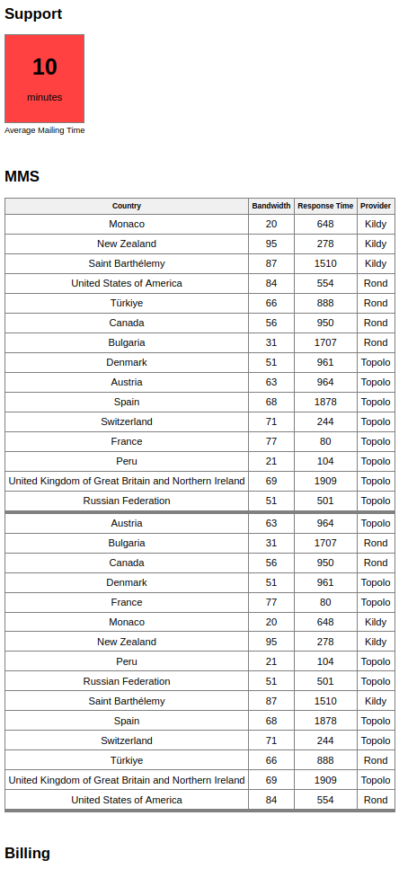

# Cетевой многопоточный сервис для Statuspage
## Дипломная работа Skillbox профессия Go-разработчик.

### Описание задачи:

>Вы пришли работать разработчиком в компанию занимающуюся провайдингом
современных средств коммуникации.

>Компания предоставляет инструменты и API для автоматизации работы систем
SMS, MMS, Голосовых звонков и Email. География клиентов распространяется на
160 стран и компания быстро растёт. Требуется всё больше ресурсов со стороны
службы поддержки и было принято решение снизить количество заявок с помощью
создания страниц информирования клиентов о текущем состоянии систем.
С помощью этих страниц компания планирует снизить количество однотипных
вопросов и высвободить время агентов службы поддержки для решения более
сложных задач.

>Поэтому каждое подразделение компании самостоятельно контролирует работу
поставщиков услуг в автоматизированном режиме храня эти данные. Ваша задача —
финализировать проект, объединив эти данные и разработав небольшой сетевой
сервис, который будет принимать запросы по сети и возвращать данные
о состоянии систем компании. Эти данные будут выводиться на web страницу
сайта компании под названием и содержать в себе географию и статусы
сервисов. Так клиенты смогут проверить свой регион на наличие ошибок прежде
чем обращаться в службу поддержки.

### Решение:

#### 1.Подготовка:
- Склонируйте к себе репозиторий.
- В соответствии с файлом Readme в проекте симулятора (../simulator) запустите проект.
  Проект сгенерирует нужные файлы и продолжит работать для обращения к нему
  по API для получения дополнительных данных которые далее понадобяться сервису в процессе обработки.Симулятор при каждом запуске генерирует новый набор данных. Часть данных
  намеренно повреждается.Цель сервиса не только получать данные, но и проверять
  их корректность в соответствии с заданием. Все некорректные данные будут
  проигнорированы в результирующих наборах.
#### 2.Сбор данных:
- После генерации данных симулятором необходимо произвести сбор и обработку данных о состояниях компании.
Запуск сервиса реализован командой:
>make run

- Сбор данных происходит в несколько этапов ,все этапы сбора происходят асинхронно друг от друга,реализованы каналы и горутины,
  так же в функциях релизована проверка на валидность данных. Неподходящие элементы в результирующую структуру не попадают.:
1. Сбор данных о системе SMS.Реализована функция получения данных о состоянии системы SMS
   из файла формата CSV.
2. Сбор данных о системе MMS.Реализована функция получения данных о состоянии системы MMS
   опрашивая API системы через HTTP GET запрос.
3. Сбор данных о системе Voice Cal.Реализована функция получения данных о состоянии системы SMS
   из файла формата CSV.
4. Сбор данных о системе Email.Реализована функцию получения данных о состоянии системы Email из файла формата CSV.
5. Сбор данных о системе Billing.Реализована функцию получения данных о состоянии системы Billing из файла
   содержащего битовую маску состояния систем,где каждый бит отвечает за состояние
   отдельной системы.
6. Сбор данных о системе Support.Реализовна функция, которая отправляет GET запрос по адресу 127.0.0.1:8484,
   разбирать полученный ответ в срез структур и возвращает его.
7. Сбор данных о системе истории инцидентов.Реализована функция, которая отправляет GET запрос по адресу 127.0.0.1:8585,
   разбирает полученный ответ в срез структур и возвращает его.

#### 2.Сортировка и фильтрация данных:
1. Полученные наборы данных на этапе сбора проходят сортировку и фильтрацию, итоговые данные записываются в
результирующий набор данных , которые будет показан клиентам в удобном для просмотра виде.

### Результат.
- Результат сервиса в виде json-таблицы можно увидеть по адресу localhost:8080.
- В удобном для просмотра виде результат доступен в html страничке в каталоге ../web необходимо 
запустить status_page.html . Он парсит данные результирующей json-таблицы с localhost:8080
и визуально упаковыет его в html.

### Завершение работы сервиса.
- Для завершения работы нажмите `Ctrl+C` в его консоли (graceful shutdown).

### Важные примечания.
- В сервисе реализована асинхронность сбора данных.Каждый сбор данных выполняется
  в отдельном потоке с помощью ключевого слова go. Для этого использованы каналы.
- Состояние систем в реальных проектах не меняется каждую долю секунды.
  Для улучшения быстродействия полученный результат храниться в кеше в
  течение 30-ти секунд в глобальной переменной и возвращатся без опроса
  систем на каждый запрос к вашему сервису.

### Пример работы сервиса:

